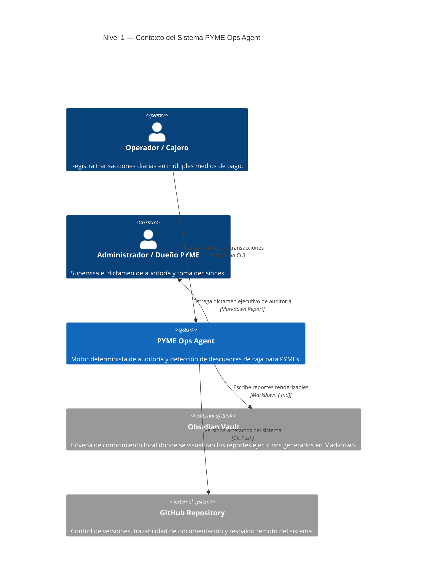
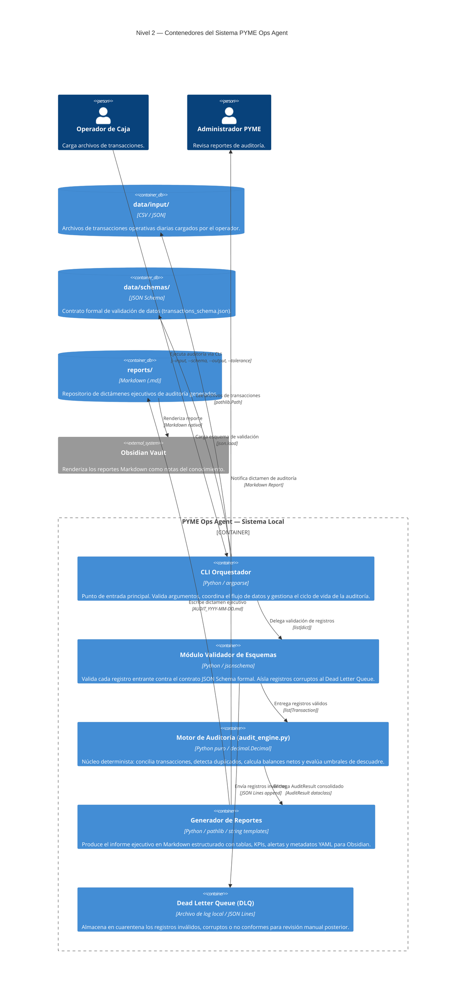
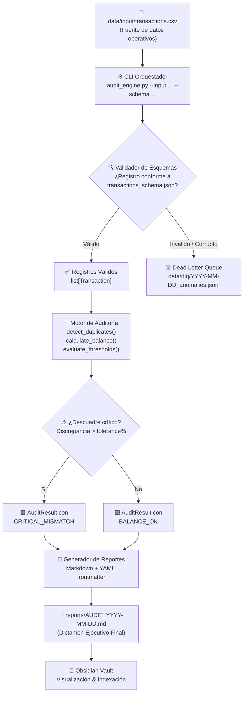

# Documento de Diseño Arquitectónico — PYME Ops Agent

> **Proyecto:** PYME Ops Agent  
> **Fase SDLC:** 03 - Diseño del Sistema  
> **Líder de Fase:** System Architect Agent  
> **Revisores:** Business Analyst (validación de requisitos), Software Engineer (viabilidad de implementación), QA Engineer (verificabilidad)

---

## 1. Visión General de la Arquitectura

El sistema adopta un **patrón de arquitectura en capas desacopladas** (Layered + Pipe-and-Filter), donde cada componente tiene responsabilidades únicas y contratos de interfaz explícitos. Esto garantiza la independencia entre la lógica matemática determinista y la capa de presentación/orquestación cognitiva, eliminando el riesgo de alucinación numérica en ambos extremos del flujo.

---

## 2. Diagrama C4 — Nivel 1: Contexto del Sistema



---

## 3. Diagrama C4 — Nivel 2: Contenedores del Sistema



---

## 4. Diagrama de Flujo de Datos — Pipe-and-Filter



---

## 5. Patrón de Diseño: Separación Estricta de Capas

El diseño se fundamenta en la separación en dos capas funcionalmente independientes y contractualmente aisladas:

### Capa 1 — Núcleo Determinista (Python CLI Idempotente)
| Atributo | Especificación |
| :--- | :--- |
| **Responsabilidad** | Toda computación matemática: suma, detección de duplicados, evaluación de umbrales y consolidación de balances. |
| **Garantía Nuclear** | La misma entrada siempre produce la misma salida. **Cero estado mutable global**. Funciones puras. |
| **Tipo de Dato Monetario** | `decimal.Decimal` con `ROUND_HALF_UP` a 2 decimales. `float` estrictamente prohibido. |
| **Dependencias** | Exclusivamente librería estándar de Python 3.10+ (`json`, `csv`, `decimal`, `datetime`, `pathlib`, `dataclasses`, `typing`). |
| **Interfaz de Ejecución** | CLI mediante `argparse`. No expone API HTTP ni requiere daemon o servicio de fondo. |
| **Idempotencia** | Ejecutar el motor N veces con el mismo input produce siempre el mismo reporte de output idéntico bit-a-bit. |

### Capa 2 — Interfaz Cognitiva y de Visualización (Obsidian + Agentes)
| Atributo | Especificación |
| :--- | :--- |
| **Responsabilidad** | Renderizado visual de reportes, indexación de conocimiento, orquestación de agentes y navegación contextual. |
| **Tecnología** | Markdown (CommonMark/GFM), Obsidian Vault, SOP Documents y agentes de lenguaje natural. |
| **Punto de Integración** | La Capa 2 **consume únicamente artefactos Markdown** escritos por la Capa 1. **No ejecuta cálculos financieros directamente**. |
| **Cero Contaminación Cruzada** | Ningún módulo de la Capa 1 importa librerías de IA, modelos de lenguaje o dependencias de la Capa 2. |

---

## 6. Estrategia de Manejo de Errores y Tolerancia a Fallos

El sistema adopta una política de **Fail-Fast + Aislamiento con Dead Letter Queue (DLQ)**, garantizando que los registros corruptos nunca contaminen los cálculos del núcleo determinista.

### 6.1 Taxonomía de Errores y Respuestas del Sistema

| Tipo de Error | Ejemplo Concreto | Respuesta del Sistema | Destino |
| :--- | :--- | :--- | :--- |
| **Campo obligatorio ausente** | Registro sin `monto` o sin `tipo` | Registro aislado, `DataValidationError` logged | DLQ |
| **Tipo de dato incompatible** | `monto: "veinte"` (string en lugar de number) | Conversión fallida, error capturado, aislado | DLQ |
| **Timestamp inválido** | `"2026-13-45T99:99"` o zona horaria ausente | Rechazo estricto con mensaje de error específico | DLQ |
| **Enum fuera de dominio** | `metodo_pago: "bitcoin"` | `DataValidationError` con campo y valor incriminado | DLQ |
| **Monto negativo o cero** | `monto: -150.00` | Violación de contrato `exclusiveMinimum: 0`, aislado | DLQ |
| **Duplicado temporal** | Mismo monto+método+referencia en ≤ 180s | Marcado con flag `DUPLICATE_SUSPECTED`, incluido en reporte de alertas | Alerta |
| **Descuadre crítico** | Discrepancia > 5% | `DiscrepancyThresholdExceeded` raised, alerta `CRITICAL_MISMATCH` en reporte | Reporte |
| **Archivo de entrada vacío** | 0 registros válidos procesados | Ejecución terminada, error explícito `EmptyDatasetError` en log | Log CLI |

### 6.2 Estructura del Dead Letter Queue (DLQ)
Los registros inválidos se almacenan en `data/dlq/YYYY-MM-DD_anomalies.jsonl` en formato JSON Lines, con la siguiente estructura de envelope:

```json
{
  "dlq_id": "DLQ-20260907-001",
  "timestamp_registro": "2026-09-07T14:30:00Z",
  "motivo_rechazo": "Campo 'monto' con valor no numérico: 'veinte'",
  "campo_incriminado": "monto",
  "valor_recibido": "veinte",
  "registro_original": { "id_transaccion": "TRX-001", "monto": "veinte", "..." : "..." }
}
```

---

## 7. Estrategia de Persistencia y Directorios

```text
pyme-ops-agent/
├── data/
│   ├── input/           # Archivos de transacciones operativas (inmutables en tiempo de ejecución)
│   ├── schemas/         # Contratos formales de validación JSON Schema
│   └── dlq/             # Dead Letter Queue — registros anómalos cuarentenados
├── tools/               # Motores deterministas Python (Capa 1)
│   ├── audit_engine.py  # Motor principal de auditoría
│   ├── validator.py     # Validador de esquemas y tipos
│   └── report_gen.py    # Generador de reportes Markdown
└── reports/             # Dictámenes ejecutivos de auditoría generados (Capa 2 → Obsidian)
```

---

## 8. Criterios de Aceptación de la Fase 3
1. [x] Diagramas C4 Nivel 1 (Contexto) y Nivel 2 (Contenedores) en Mermaid.js documentados.
2. [x] Diagrama de flujo Pipe-and-Filter de extremo a extremo.
3. [x] Separación de capas formalmente definida con atributos técnicos verificables.
4. [x] Taxonomía completa de errores y política DLQ documentada.
5. [x] Contrato de interfaces del motor definido en `tools/audit_engine_spec.py`.
6. [x] SOP operativo del skill `audit_pyme_cashflow` creado en `sops/`.
